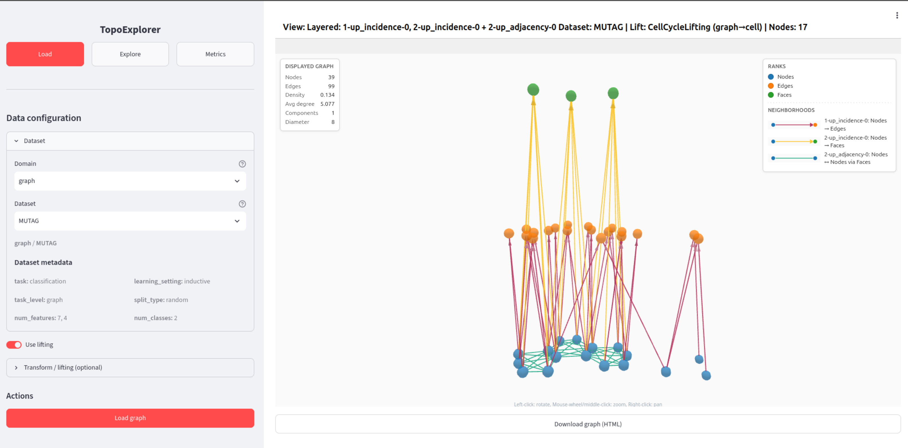
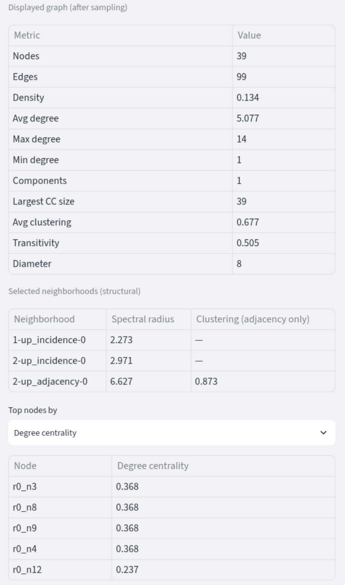

<div align="center">

# TopoExplorer

**A visual and quantitative diagnostic framework for topological deep learning liftings.**

[](LICENSE)
[](runtime.txt)
[](https://github.com/geometric-intelligence/topobench)
[](https://topoexplorer.pagekite.me/)



</div>

---

## What is TopoExplorer?

Topological Deep Learning (TDL) generalizes graph neural networks to higher-order
interactions. Most TDL pipelines begin with a **lifting procedure** that turns a graph
into a higher-order domain (simplicial, cellular, hypergraph, or combinatorial complex)
before a model is trained on it. But different liftings can induce drastically different
connectivity on the *same* dataset, and today those choices are usually made from a menu
with little structural inspection — a blind **lift-then-train** workflow.

**TopoExplorer** turns that into a principled **lift → diagnose → design → train** workflow.
It exposes the *strictly augmented Hasse graph* of any lifted complex — making its
**neighborhoods** (incidence and adjacency, across cell ranks) explicit in graph form — and
lets you both *see* and *measure* the structure a lifting creates before committing to
training. Alongside the interactive visualization, it computes structural and feature-based
graph metrics (spectral radius, clustering coefficient, Forman–Ricci curvature, degree
statistics, connected components, heterophily, …) that can be compared across candidate
liftings and neighborhood choices.

**At a glance:**

- 🔎 **Inspect** liftings across the simplicial, cellular, hypergraph and combinatorial domains from the TopoBench catalogue.
- 🧩 **Toggle neighborhoods** — graph/higher-order adjacency and incidence — and view each as an interactive Hasse graph, individually or combined.
- 📊 **Quantify structure** with pre-training graph metrics to inform lifting and neighborhood design decisions.
- 💾 **Export** any view as a self-contained, shareable HTML file with all computed metrics embedded.

> Try it now — no install needed: **<https://topoexplorer.pagekite.me/>**

---

## Installation

### Prerequisites

- **Python 3.11** (TopoBench pins `>=3.11, <3.12`)
- `pip`

### Linux / macOS

```bash
# 1. Clone the repository
git clone https://github.com/geometric-intelligence/topoexplorer.git
cd topoexplorer

# 2. Create and activate a virtual environment
python3.11 -m venv .venv
source .venv/bin/activate

# 3. Install dependencies
pip install -r requirements.txt

# 4. Run the app
streamlit run topoexplorer/neighborhood_explorer_app.py
```

The app opens in your browser at <http://localhost:8501>.

`requirements.txt` installs `torch` (CPU build), the PyG companion wheels, `streamlit`, and
`topobench` (from its [GitHub repository](https://github.com/geometric-intelligence/topobench),
as it is not published on PyPI).

### Windows

Some TopoBench transitive dependencies do not build cleanly on Windows, so a helper script
installs a working subset:

```powershell
./setup-windows.ps1
.\.venv\Scripts\Activate.ps1
streamlit run topoexplorer\neighborhood_explorer_app.py
```

---

## Usage guide

TopoExplorer follows a simple six-step workflow, all driven from the sidebar (see the
overview screenshot above, using the bundled **MUTAG** dataset):

1. **Select a dataset.** Choose a topological domain and dataset. The app shows descriptive
   metadata (task, number of features, number of classes, …).
2. **Configure a lifting.** Pick a target domain (hypergraph, simplicial, cell, combinatorial)
   and a lifting method from the TopoBench catalogue, together with its hyperparameters.
3. **Load and lift.** Click **Load graph** to load and cache the dataset via the TopoBench API;
   the lifting is applied to the selected sample, producing the higher-order complex.
4. **Select neighborhoods.** Choose one or more neighborhood types — graph adjacency, graph
   incidence, higher-order adjacency (across ranks), higher-order incidence (between ranks).
   Each is rendered as a Hasse graph you can inspect individually or combine to compare
   information flow across ranks.
5. **Read the metrics.** Inspect the structural and feature-based metrics computed for the
   current view (see below). They are meant to be read *comparatively* — across candidate
   liftings, neighborhoods, and hyperparameters — not against universal thresholds.
6. **Adjust, render and export.** Navigate between samples (inductive datasets re-apply the
   lifting automatically) and adjust display filters (minimum cell degree, maximum cells per
   rank) without changing the underlying complex. Then explore the interactive view, open it
   in a standalone window, or export it as a self-contained HTML file with all metrics embedded.

<p align="center"></p>

---

## Repository structure

| Path | Description |
| --- | --- |
| `topoexplorer/` | Application source code (Streamlit app, graph metrics, D3 renderer). |
| `topoexplorer/neighborhood_explorer_app.py` | Main Streamlit entry point. |
| `topoexplorer/graph_metrics.py` | Structural and feature-based graph metric computations. |
| `topoexplorer/d3_graph_html.py` | Standalone D3 HTML export of a graph view. |
| `datasets/` | Bundled sample dataset (MUTAG, from TUDataset). |
| `docs/img/` | Screenshots and GIFs used in this README. |
| `.streamlit/` | Streamlit server configuration. |
| `requirements.txt` · `runtime.txt` | Dependency and Python-version pins. |
| `setup-windows.ps1` | Windows installation helper. |

---

## The paper

TopoExplorer accompanies the paper **_TopoExplorer: Interact and Diagnose Any Lifted
Topological Dataset_**. To the best of our knowledge, it is the first exploratory data and
visualization framework for informing lifting design decisions in TDL: the paper shows that
several pre-training metrics computed in TopoExplorer correlate with downstream model
performance, supporting a structure-aware design pipeline.

- **Live app:** <https://topoexplorer.pagekite.me/>
- **Built on:** [TopoBench](https://github.com/geometric-intelligence/topobench)
- **Related architectures:** TopoTune and HOPSE, which process neighborhoods as separate channels.

> 📄 **Citation:** the paper is forthcoming — a citation and BibTeX entry will be added here
> upon publication.

---

## License and community

Released under the [MIT License](LICENSE). Please follow our
[Code of Conduct](.github/CODE_OF_CONDUCT.md) when participating in the project.
